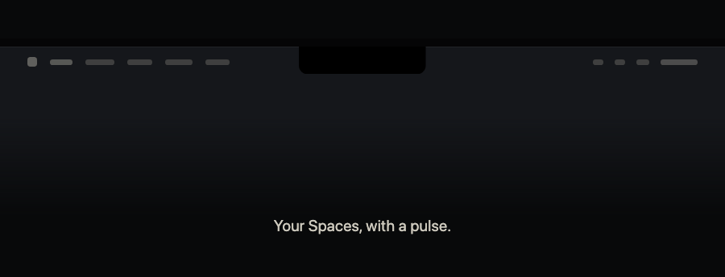

<div align="center">

# Xyne Island

**Everything from Xyne Spaces that needs you, in the MacBook notch.**



[Install](#install) · [How it works](#how-it-works) · [The cast](#the-cast) · [Watch the 105-second tour](assets/tour-film.mp4) · [Architecture](docs/architecture.md)

</div>

---

Mentions, agents working for you, the next call, tickets going overdue, and
approvals waiting on you appear as a small cast above your work. Click any card
to jump into Spaces; answer mentions and approvals without leaving what you were
doing.

Nothing leaves your machine except the Spaces API calls your own session already
makes. There is no account, no analytics, and no server in the middle.

## Install

Download the latest `XyneIsland-<version>.dmg` from
[Releases](../../releases/latest), open it, and drag **Xyne Island** to
Applications.

You also need two things Xyne Island uses rather than reimplements:

```bash
# Node 22.6 or newer — the bridge that talks to Spaces runs on it
node --version

# The Spaces CLI — the only thing that can turn your browser session into a token
npm install -g @xyne/spaces-cli
```

Open Xyne Island. On first launch it fetches a Spaces token with `spaces token`,
which reads the session from the browser where you are already signed in. If you
are signed out, the notch says so, and the menu bar has **Refresh Spaces Token**.

Full walkthrough, including what to do when something does not connect:
[docs/install.md](docs/install.md).

## How it works

Two processes, one socket.

```
   Xyne Spaces  ──HTTPS──▶  bridge (Node)  ──Unix socket──▶  notch app (SwiftUI)
                                 │                                   │
                          spaces token                        you press Open
                          keeps the token fresh                      │
                                 ▼                                   ▼
                       ~/.config/xyne-island/env            Spaces, in your browser
```

- The **notch app** draws cards and owns the bridge's lifetime. It starts it at
  launch, restarts it if it dies, and stops it on quit.
- The **bridge** polls Spaces every 12 seconds, works out what each thing means,
  and sends the notch a finished card. Cards that ask something hold their
  connection open, so Open and Done round-trip back to Spaces.
- **Tokens refresh themselves.** The bridge checks expiry before every poll and
  runs `spaces token` a few minutes ahead of time; if Spaces rejects a token
  anyway, it runs `spaces token --update` and retries. Credentials live in
  `~/.config/xyne-island/env` with `0600` permissions, never in this repository.

More detail, including the wire protocol: [docs/architecture.md](docs/architecture.md).

## The cast

| Who | What it carries |
| --- | --- |
| **Pip** | A mention, a reply, a group mention, a DM |
| **Stub** | A ticket: assigned to you, due, changed, or waiting on your approval |
| **Ring** | A call: upcoming, starting, live, or missed |
| **Beam** | The Spaces Architect |
| **Sage** | Ask AI |
| **Doc** | Every other Spaces agent: the doctors, automations, custom bots |

Each card wears a state: **LIVE**, **NEEDS YOU**, **APPROVAL**, **DONE**,
**OVERDUE**, or **FYI**. What needs you sorts to the top and opens the notch on
its own; everything else waits quietly and retires when its moment has passed.

## Build from source

macOS 14+, Xcode 16+ / Swift 6, Node 22.6+.

```bash
git clone <this-repo> xyne-island && cd xyne-island
swift test                     # 28 tests
./scripts/package-app.sh       # builds "build/Xyne Island.app" with the bridge inside
open "build/Xyne Island.app"
```

To iterate on the bridge without repackaging, run it yourself against the app:

```bash
cd sidecar && npm install
XYNE_ISLAND_NO_SIDECAR=1 open "../build/Xyne Island.app"
npm start                      # the bridge, in your terminal, with its output visible
```

No Spaces session, or just want to see it? Play a scripted day:

```bash
cd sidecar
npm run scenes                 # the whole day
npm run scenes -- mention      # one scene: agent, mention, ticket, call, pr, overdue, doctor, missed, approval
npm run demo                   # keyboard-driven director, for showing it to a room
```

## Layout

```
Sources/XyneIslandApp/     the notch UI, the panel, and the bridge's supervisor
Sources/XyneIslandCore/    the card model, the wire protocol, the Unix socket
sidecar/src/               the bridge: token, Spaces readers, card building, socket
scripts/                   package-app.sh, make-dmg.sh
docs/                      architecture, install, releasing, demo, brand
assets/                    the app icon and the films
marketing/video/           Remotion sources for those films
```

## Contributing

[CONTRIBUTING.md](CONTRIBUTING.md) has the development setup and the change
rules. Security reports go through [SECURITY.md](SECURITY.md), never a public
issue. What crosses which boundary is written down in [PRIVACY.md](PRIVACY.md).

MIT licensed. See [LICENSE](LICENSE) and [NOTICE.md](NOTICE.md).
